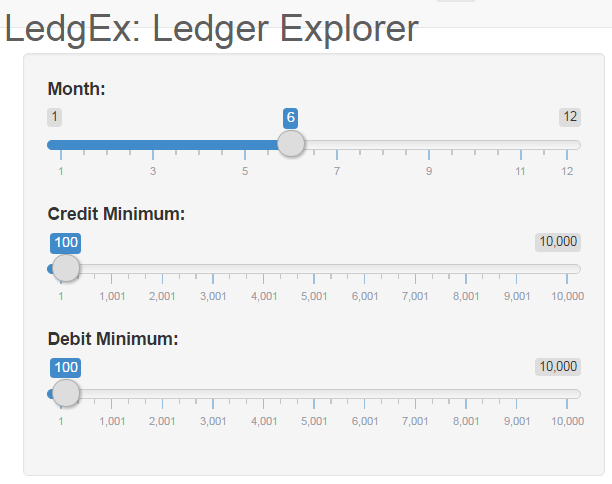

Reproducible Pitch
========================================================
author: Martin Skarzynski
date: January 12, 2017
autosize: true

Introduction
========================================================
For the final project of the Coursera course Developing Data Products (DDP) course, I 
- Generated a tidy version of a publicly available dataset
- Developed and deployed a web app for analyzing the tidy dataset
- Created and published this presentation using R presenter

Source Files:
*  The dataset is available for download [here](http://www.journalofaccountancy.com/issues/2017/jan/general-ledger-data-mining.html).
* The web app is deployed [here](https://marskar.shinyapps.io/DDPfinal).
* To access the source code for data cleaning script, the web app and this presentation,
please visit [my DDP GitHub repo](https://github.com/marskar/DDPfinal).

Example Output
========================================================

<iframe src="demo.html" style="position:absolute;height:100%;width:100%"></iframe>

User Input Sidebar
========================================================

Conclusions
========================================================

- LedgEx is a web app designed for mining financial transaction data!

- Its straightforward user interface makes interacting with the data a breeze.

- Forget about poring over numbers in Excel... 

- Use LedgEx and get business insights from the most up-to-date data through your internet browser!

